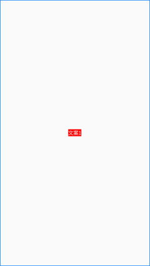
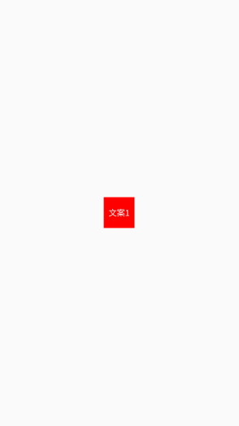
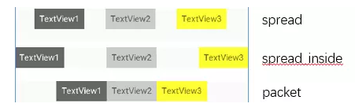
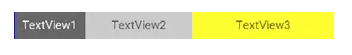

# 属性

## 文本基线对准


两个`TextView`的高度不一致，但是又希望他们文本对齐，这个时候就可以使用`layout_constraintBaseline_toBaselineOf`

```xml
    <TextView
        android:id="@+id/TextView1"
        .../>

    <TextView
        android:id="@+id/TextView2"
        ...
        app:layout_constraintLeft_toRightOf="@+id/TextView1" 
        app:layout_constraintBaseline_toBaselineOf="@+id/TextView1"/>
```

## 角度定位


```xml
    <TextView
        android:id="@+id/TextView1"
        android:layout_width="wrap_content"
        android:layout_height="wrap_content" />

    <TextView
        android:id="@+id/TextView2"
        android:layout_width="wrap_content"
        android:layout_height="wrap_content"
        app:layout_constraintCircle="@+id/TextView1"
        app:layout_constraintCircleAngle="120"		//角度
        app:layout_constraintCircleRadius="150dp" />	//距离
```

## 边距`goneMargin`

`goneMargin`主要用于约束的控件可见性被设置为gone的时候使用的`margin`值

```xml
<android.support.constraint.ConstraintLayout 
    android:layout_width="match_parent"
    android:layout_height="match_parent">

    <TextView
        android:id="@+id/TextView1"
        .../>

    <TextView
        android:id="@+id/TextView2"
        ...
        app:layout_constraintLeft_toRightOf="@+id/TextView1"
        app:layout_goneMarginLeft="10dp"
        />

</android.support.constraint.ConstraintLayout>
```

`TextView2`在`TextView1`的右边，且没有边距


把`TextView1`的可见性设为`gone`


## 居中和偏移

居中效果如下



```xml
<?xml version="1.0" encoding="utf-8"?>
<androidx.constraintlayout.widget.ConstraintLayout xmlns:android="http://schemas.android.com/apk/res/android"
    xmlns:app="http://schemas.android.com/apk/res-auto"
    xmlns:tools="http://schemas.android.com/tools"
    android:layout_width="match_parent"
    android:layout_height="match_parent"
    tools:context=".MainActivity">

    <TextView
        android:id="@+id/tv1"
        android:layout_width="wrap_content"
        android:layout_height="wrap_content"
        android:background="#f00"
        android:gravity="center"
        android:text="文案1"
        android:textColor="@android:color/white"
        app:layout_constraintBottom_toBottomOf="parent"
        app:layout_constraintEnd_toEndOf="parent"
        app:layout_constraintHorizontal_bias="0.2"	//水平偏移值
        app:layout_constraintStart_toStartOf="parent"
        app:layout_constraintTop_toTopOf="parent"
        app:layout_constraintVertical_bias="0.2" />		//垂直偏移值

</androidx.constraintlayout.widget.ConstraintLayout>
```

## 尺寸约束

> 宽高比



当宽或高至少有一个尺寸被设置为`0dp`时，可以通过属性`layout_constraintDimensionRatio`设置宽高比

在设置宽高比的值的时候，还可以在前面加W或H，分别指定宽度或高度限制

`app:layout_constraintDimensionRatio="H,2:3"指的是  高:宽=2:3`
`app:layout_constraintDimensionRatio="W,2:3"指的是  宽:高=2:3`

```xml
<?xml version="1.0" encoding="utf-8"?>
<androidx.constraintlayout.widget.ConstraintLayout xmlns:android="http://schemas.android.com/apk/res/android"
    xmlns:app="http://schemas.android.com/apk/res-auto"
    xmlns:tools="http://schemas.android.com/tools"
    android:layout_width="match_parent"
    android:layout_height="match_parent"
    tools:context=".MainActivity">

    <TextView
        android:id="@+id/tv1"
        android:layout_width="0dp"
        android:layout_height="wrap_content"
        android:background="#f00"
        android:gravity="center"
        android:text="文案1"
        android:textColor="@android:color/white"
        app:layout_constraintBottom_toBottomOf="parent"
        app:layout_constraintDimensionRatio="1:1"	//设置宽高比
        app:layout_constraintEnd_toEndOf="parent"
        app:layout_constraintStart_toStartOf="parent"
        app:layout_constraintTop_toTopOf="parent" />

</androidx.constraintlayout.widget.ConstraintLayout>
```

## 链

如果两个或以上控件通过下图的方式约束在一起，就可以认为是他们是一条链（图为横向的链，纵向同理）



```xml
<?xml version="1.0" encoding="utf-8"?>
<androidx.constraintlayout.widget.ConstraintLayout xmlns:android="http://schemas.android.com/apk/res/android"
    xmlns:app="http://schemas.android.com/apk/res-auto"
    android:layout_width="match_parent"
    android:layout_height="match_parent">

    <TextView
        android:id="@+id/tv1"
        android:layout_width="wrap_content"
        android:layout_height="wrap_content"
        android:background="#f00"
        android:text="文本1"
        android:textColor="@android:color/white"
        app:layout_constraintHorizontal_chainStyle="packed"	//水平方向链样式，另外有垂直方向的链样式
        app:layout_constraintLeft_toLeftOf="parent"
        app:layout_constraintRight_toLeftOf="@id/tv2" />

    <TextView
        android:id="@+id/tv2"
        android:layout_width="wrap_content"
        android:layout_height="wrap_content"
        android:background="#0f0"
        android:text="文本2"
        android:textColor="@android:color/white"
        app:layout_constraintLeft_toRightOf="@id/tv1"
        app:layout_constraintRight_toLeftOf="@id/tv3"
        app:layout_constraintTop_toTopOf="parent" />

    <TextView
        android:id="@+id/tv3"
        android:layout_width="wrap_content"
        android:layout_height="wrap_content"
        android:background="#00f"
        android:text="文本3"
        android:textColor="@android:color/white"
        app:layout_constraintLeft_toRightOf="@id/tv2"
        app:layout_constraintRight_toRightOf="parent" />
</androidx.constraintlayout.widget.ConstraintLayout>
```

> 权重链

3个`TextView`宽度都为`wrap_content`，如果我们把宽度都设为`0dp`，这个时候可以在每个`TextView`中设置横向权重`layout_constraintHorizontal_weight(constraintVertical为纵向)`来创建一个权重链



```xml
 <TextView
        android:id="@+id/TextView1"
        android:layout_width="0dp"
        android:layout_height="wrap_content"
        app:layout_constraintLeft_toLeftOf="parent"
        app:layout_constraintRight_toLeftOf="@+id/TextView2"
        app:layout_constraintHorizontal_weight="2" />

    <TextView
        android:id="@+id/TextView2"
        android:layout_width="0dp"
        android:layout_height="wrap_content"
        app:layout_constraintLeft_toRightOf="@+id/TextView1"
        app:layout_constraintRight_toLeftOf="@+id/TextView3"
        app:layout_constraintRight_toRightOf="parent"
        app:layout_constraintHorizontal_weight="3" />

    <TextView
        android:id="@+id/TextView3"
        android:layout_width="0dp"
        android:layout_height="wrap_content"
        app:layout_constraintLeft_toRightOf="@+id/TextView2"
        app:layout_constraintRight_toRightOf="parent"
        app:layout_constraintHorizontal_weight="4" />
```

