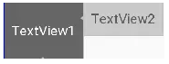
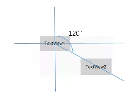

# 属性

> 文本基线对准



两个`TextView`的高度不一致，但是又希望他们文本对齐，这个时候就可以使用`layout_constraintBaseline_toBaselineOf`

```xml
    <TextView
        android:id="@+id/TextView1"
        .../>

    <TextView
        android:id="@+id/TextView2"
        ...
        app:layout_constraintLeft_toRightOf="@+id/TextView1" 
        app:layout_constraintBaseline_toBaselineOf="@+id/TextView1"/>
```

> 角度定位



```xml
    <TextView
        android:id="@+id/TextView1"
        android:layout_width="wrap_content"
        android:layout_height="wrap_content" />

    <TextView
        android:id="@+id/TextView2"
        android:layout_width="wrap_content"
        android:layout_height="wrap_content"
        app:layout_constraintCircle="@+id/TextView1"
        app:layout_constraintCircleAngle="120"		//角度
        app:layout_constraintCircleRadius="150dp" />	//距离
```

> 边距`goneMargin`

`goneMargin`主要用于约束的控件可见性被设置为gone的时候使用的`margin`值

```xml
<android.support.constraint.ConstraintLayout 
    android:layout_width="match_parent"
    android:layout_height="match_parent">

    <TextView
        android:id="@+id/TextView1"
        .../>

    <TextView
        android:id="@+id/TextView2"
        ...
        app:layout_constraintLeft_toRightOf="@+id/TextView1"
        app:layout_goneMarginLeft="10dp"
        />

</android.support.constraint.ConstraintLayout>
```

`TextView2`在`TextView1`的右边，且没有边距


把`TextView1`的可见性设为`gone`

