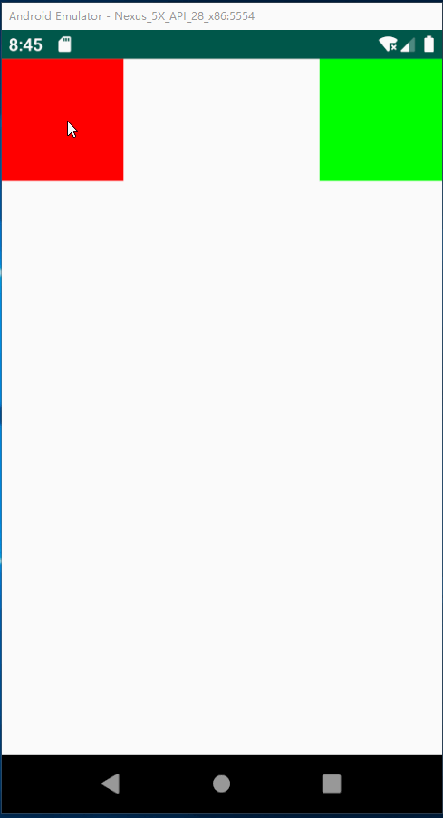
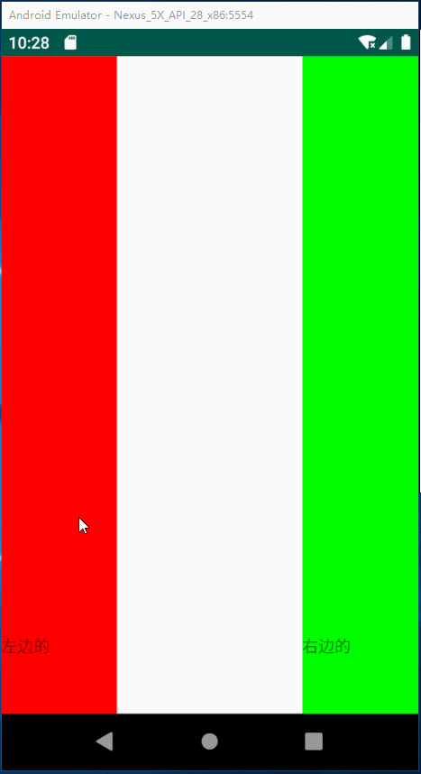

# 自定义Behavior

## 方式1

* **一个View监听另外一个View大小，位置，状态的变化而变化**

* **布局**

```xml
<?xml version="1.0" encoding="utf-8"?>
<android.support.design.widget.CoordinatorLayout xmlns:android="http://schemas.android.com/apk/res/android"
    xmlns:app="http://schemas.android.com/apk/res-auto"
    xmlns:tools="http://schemas.android.com/tools"
    android:layout_width="match_parent"
    android:layout_height="match_parent"
    tools:context="com.aib.behavior.BehaviorActivity">

    <TextView
        android:id="@+id/tv1"
        android:layout_width="100dp"
        android:layout_height="100dp"
        android:background="#f00" />

    <TextView
        android:id="@+id/tv2"
        android:layout_width="100dp"
        android:layout_height="100dp"
        android:layout_gravity="right"
        android:background="#0f0"
        app:layout_behavior="com.aib.behavior.MyBehavior" />
</android.support.design.widget.CoordinatorLayout>
```

* **自定义Behavior**

```java
public class MyBehavior extends CoordinatorLayout.Behavior<View> {
    public MyBehavior() {
    }

    public MyBehavior(Context context, AttributeSet attrs) {
        super(context, attrs);
    }

    /**
     * 监听哪个View
     *
     * @param parent
     * @param child
     * @param dependency
     * @return
     */
    @Override
    public boolean layoutDependsOn(@NonNull CoordinatorLayout parent, @NonNull View child, @NonNull View dependency) {
        return dependency instanceof TextView || super.layoutDependsOn(parent, child, dependency);
    }

    /**
     * 监听的View发生大小，位置，状态变化就回调
     *
     * @param parent
     * @param child
     * @param dependency
     * @return
     */
    @Override
    public boolean onDependentViewChanged(@NonNull CoordinatorLayout parent, @NonNull View child, @NonNull View dependency) {
        int distance = dependency.getTop() - child.getTop();
        ViewCompat.offsetTopAndBottom(child, distance); //从顶部到底部的偏移差
        return child instanceof TextView || super.onDependentViewChanged(parent, child, dependency);
    }
}
```

* **使用自定义Behavior**

```java
public class BehaviorActivity extends AppCompatActivity {

    @Override
    protected void onCreate(Bundle savedInstanceState) {
        super.onCreate(savedInstanceState);
        setContentView(R.layout.activity_behavior);

        TextView tv1 = findViewById(R.id.tv1);
        TextView tv2 = findViewById(R.id.tv2);

        tv1.setOnClickListener(new View.OnClickListener() {
            @Override
            public void onClick(View v) {
                ViewCompat.offsetTopAndBottom(v,50);
            }
        });

    }
}
```



## 方式2

* **监听嵌套滑动事件**

* **布局**

```xml
<?xml version="1.0" encoding="utf-8"?>
<android.support.design.widget.CoordinatorLayout xmlns:android="http://schemas.android.com/apk/res/android"
    xmlns:app="http://schemas.android.com/apk/res-auto"
    xmlns:tools="http://schemas.android.com/tools"
    android:layout_width="match_parent"
    android:layout_height="match_parent"
    tools:context="com.aib.behavior.BehaviorActivity">

    <android.support.v4.widget.NestedScrollView
        android:layout_width="100dp"
        android:layout_height="wrap_content"
        android:background="#f00"
        android:fillViewport="true"
        app:layout_behavior="com.aib.behavior.MyBehavior">

        <TextView
            android:layout_width="100dp"
            android:layout_height="wrap_content"
            android:paddingTop="500dp"
            android:paddingBottom="500dp"
            android:text="左边的" />
    </android.support.v4.widget.NestedScrollView>


    <android.support.v4.widget.NestedScrollView
        android:layout_width="100dp"
        android:layout_height="wrap_content"
        android:layout_gravity="right"
        android:background="#0f0"
        android:fillViewport="true"
        app:layout_behavior="com.aib.behavior.MyBehavior">

        <TextView
            android:layout_width="100dp"
            android:layout_height="wrap_content"
            android:paddingTop="500dp"
            android:paddingBottom="500dp"
            android:text="右边的" />
    </android.support.v4.widget.NestedScrollView>
</android.support.design.widget.CoordinatorLayout>
```

* **自定义Behavior**

```java
public class MyBehavior extends CoordinatorLayout.Behavior<View> {
    public MyBehavior() {
    }

    public MyBehavior(Context context, AttributeSet attrs) {
        super(context, attrs);
    }

    /**
     * 开始嵌套滑动
     *
     * @param coordinatorLayout
     * @param child
     * @param directTargetChild
     * @param target
     * @param axes
     * @param type
     * @return
     */
    @Override
    public boolean onStartNestedScroll(@NonNull CoordinatorLayout coordinatorLayout, @NonNull View child, @NonNull View directTargetChild, @NonNull View target, int axes, int type) {
        return axes == ViewCompat.SCROLL_AXIS_VERTICAL || super.onStartNestedScroll(coordinatorLayout, child, directTargetChild, target, axes, type);
    }

    /**
     * 嵌套滑动中
     *
     * @param coordinatorLayout
     * @param child
     * @param target
     * @param dxConsumed
     * @param dyConsumed
     * @param dxUnconsumed
     * @param dyUnconsumed
     * @param type
     */
    @Override
    public void onNestedScroll(@NonNull CoordinatorLayout coordinatorLayout, @NonNull View child, @NonNull View target, int dxConsumed, int dyConsumed, int dxUnconsumed, int dyUnconsumed, int type) {
        super.onNestedScroll(coordinatorLayout, child, target, dxConsumed, dyConsumed, dxUnconsumed, dyUnconsumed, type);
        int distance = target.getScrollY();
        child.setScrollY(distance);
    }
}
```

* **效果**



```java
/**
     * 表示是否给应用了Behavior 的View 指定一个依赖的布局，通常，当依赖的View 布局发生变化时
     * 不管被被依赖View 的顺序怎样，被依赖的View也会重新布局
     * @param parent
     * @param child 绑定behavior 的View
     * @param dependency   依赖的view
     * @return 如果child 是依赖的指定的View 返回true,否则返回false
     */
    @Override
    public boolean layoutDependsOn(CoordinatorLayout parent, View child, View dependency) {
        return super.layoutDependsOn(parent, child, dependency);
    }

    /**
     * 当被依赖的View 状态（如：位置、大小）发生变化时，这个方法被调用
     * @param parent
     * @param child
     * @param dependency
     * @return
     */
    @Override
    public boolean onDependentViewChanged(CoordinatorLayout parent, View child, View dependency) {
        return super.onDependentViewChanged(parent, child, dependency);
    }

    /**
     *  当coordinatorLayout 的子View试图开始嵌套滑动的时候被调用。当返回值为true的时候表明
     *  coordinatorLayout 充当nested scroll parent 处理这次滑动，需要注意的是只有当返回值为true
     *  的时候，Behavior 才能收到后面的一些nested scroll 事件回调（如：onNestedPreScroll、onNestedScroll等）
     *  这个方法有个重要的参数nestedScrollAxes，表明处理的滑动的方向。
     *
     * @param coordinatorLayout 和Behavior 绑定的View的父CoordinatorLayout
     * @param child  和Behavior 绑定的View
     * @param directTargetChild
     * @param target
     * @param nestedScrollAxes 嵌套滑动 应用的滑动方向，看 {@link ViewCompat#SCROLL_AXIS_HORIZONTAL},
     *                         {@link ViewCompat#SCROLL_AXIS_VERTICAL}
     * @return
     */
    @Override
    public boolean onStartNestedScroll(CoordinatorLayout coordinatorLayout, View child, View directTargetChild, View target, int nestedScrollAxes) {
        return super.onStartNestedScroll(coordinatorLayout, child, directTargetChild, target, nestedScrollAxes);
    }

    /**
     * 嵌套滚动发生之前被调用
     * 在nested scroll child 消费掉自己的滚动距离之前，嵌套滚动每次被nested scroll child
     * 更新都会调用onNestedPreScroll。注意有个重要的参数consumed，可以修改这个数组表示你消费
     * 了多少距离。假设用户滑动了100px,child 做了90px 的位移，你需要把 consumed［1］的值改成90，
     * 这样coordinatorLayout就能知道只处理剩下的10px的滚动。
     * @param coordinatorLayout
     * @param child
     * @param target
     * @param dx  用户水平方向的滚动距离
     * @param dy  用户竖直方向的滚动距离
     * @param consumed
     */
    @Override
    public void onNestedPreScroll(CoordinatorLayout coordinatorLayout, View child, View target, int dx, int dy, int[] consumed) {
        super.onNestedPreScroll(coordinatorLayout, child, target, dx, dy, consumed);
    }

    /**
     * 进行嵌套滚动时被调用
     * @param coordinatorLayout
     * @param child
     * @param target
     * @param dxConsumed target 已经消费的x方向的距离
     * @param dyConsumed target 已经消费的y方向的距离
     * @param dxUnconsumed x 方向剩下的滚动距离
     * @param dyUnconsumed y 方向剩下的滚动距离
     */
    @Override
    public void onNestedScroll(CoordinatorLayout coordinatorLayout, View child, View target, int dxConsumed, int dyConsumed, int dxUnconsumed, int dyUnconsumed) {
        super.onNestedScroll(coordinatorLayout, child, target, dxConsumed, dyConsumed, dxUnconsumed, dyUnconsumed);
    }

    /**
     *  嵌套滚动结束时被调用，这是一个清除滚动状态等的好时机。
     * @param coordinatorLayout
     * @param child
     * @param target
     */
    @Override
    public void onStopNestedScroll(CoordinatorLayout coordinatorLayout, View child, View target) {
        super.onStopNestedScroll(coordinatorLayout, child, target);
    }

    /**
     * onStartNestedScroll返回true才会触发这个方法，接受滚动处理后回调，可以在这个
     * 方法里做一些准备工作，如一些状态的重置等。
     * @param coordinatorLayout
     * @param child
     * @param directTargetChild
     * @param target
     * @param nestedScrollAxes
     */
    @Override
    public void onNestedScrollAccepted(CoordinatorLayout coordinatorLayout, View child, View directTargetChild, View target, int nestedScrollAxes) {
        super.onNestedScrollAccepted(coordinatorLayout, child, directTargetChild, target, nestedScrollAxes);
    }

    /**
     * 用户松开手指并且会发生惯性动作之前调用，参数提供了速度信息，可以根据这些速度信息
     * 决定最终状态，比如滚动Header，是让Header处于展开状态还是折叠状态。返回true 表
     * 示消费了fling.
     *
     * @param coordinatorLayout
     * @param child
     * @param target
     * @param velocityX x 方向的速度
     * @param velocityY y 方向的速度
     * @return
     */
    @Override
    public boolean onNestedPreFling(CoordinatorLayout coordinatorLayout, View child, View target, float velocityX, float velocityY) {
        return super.onNestedPreFling(coordinatorLayout, child, target, velocityX, velocityY);
    }

    //可以重写这个方法对子View 进行重新布局
    @Override
    public boolean onLayoutChild(CoordinatorLayout parent, View child, int layoutDirection) {
        return super.onLayoutChild(parent, child, layoutDirection);
    }
```

---

# BottomSheetBehavior

>概述
```
Behavior行为，需要加入Design包
```

>XML布局

需要配合在CoordinatorLayout布局下，使用app:layout_behavior="@string/bottom_sheet_behavior"标记控件
```
<?xml version="1.0" encoding="utf-8"?>
<android.support.design.widget.CoordinatorLayout xmlns:android="http://schemas.android.com/apk/res/android"
    xmlns:app="http://schemas.android.com/apk/res-auto"
    xmlns:tools="http://schemas.android.com/tools"
    android:layout_width="match_parent"
    android:layout_height="match_parent"
    tools:context=".MainActivity">

    <Button
        android:id="@+id/btn"
        android:layout_width="wrap_content"
        android:layout_height="wrap_content"
        android:text="显示/隐藏" />

    <RelativeLayout
        android:id="@+id/rl"
        android:layout_width="match_parent"
        android:layout_height="200dp"
        android:background="#f00"
        app:layout_behavior="@string/bottom_sheet_behavior">

        <TextView
            android:layout_width="wrap_content"
            android:layout_height="wrap_content"
            android:text="底部" />
    </RelativeLayout>
</android.support.design.widget.CoordinatorLayout>
```

>java代码
```
class MainActivity : AppCompatActivity() {

    override fun onCreate(savedInstanceState: Bundle?) {
        super.onCreate(savedInstanceState)
        setContentView(R.layout.activity_main)

        val btn = findViewById<Button>(R.id.btn)
        val rl = findViewById<RelativeLayout>(R.id.rl)

        val sheetBehavior = BottomSheetBehavior.from(rl)
        sheetBehavior.peekHeight = 0    //默认的高度
//        sheetBehavior.state = BottomSheetBehavior.STATE_HIDDEN
        btn.setOnClickListener {
            sheetBehavior.state = BottomSheetBehavior.STATE_HALF_EXPANDED
        }

    }
}
```

>坑1：嵌套滑动控件(WebView)

当嵌套滑动控件的时候，容易造成里面的滑动控件不可以滑动到顶部，就已经把页面关闭了，需要在滑动控件上添加android:nestedScrollingEnabled="true"