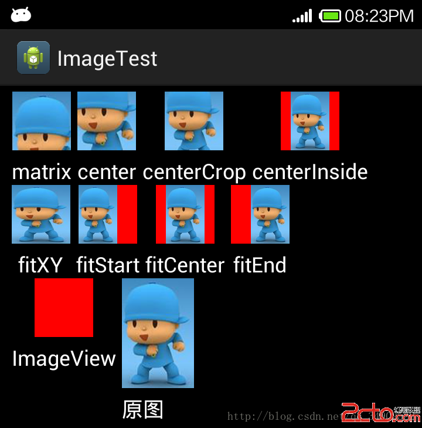

# 属性

## scaleType

> center

保持原图的大小，显示在ImageView的中心。当原图的size大于ImageView的size时，多出来的部分被截掉

> center_inside

以原图正常显示为目的，如果原图大小大于ImageView的size，就按照比例缩小原图的宽高，居中显示在ImageView中。如果原图size小于ImageView的size，则不做处理居中显示图片

> center_crop

以原图填满ImageView为目的，如果原图size大于ImageView的size，则与center_inside一样，按比例缩小，居中显示在ImageView上。如果原图size小于ImageView的size，则按比例拉升原图的宽和高，填充ImageView居中显示

> matrix

不改变原图的大小，从ImageView的左上角开始绘制，超出部分做剪切处理

> fit_xy

把图片按照指定的大小在ImageView中显示，拉伸显示图片，不保持原比例，填满ImageView

> fit_start

把原图按照比例放大缩小到ImageView的高度，显示在ImageView的start（前部/上部）

> fit_center

把原图按照比例放大缩小到ImageView的高度，显示在ImageView的center（中部/居中显示）

> fit_end

把原图按照比例放大缩小到ImageView的高度，显示在ImageVIew的end（后部/尾部/底部）

