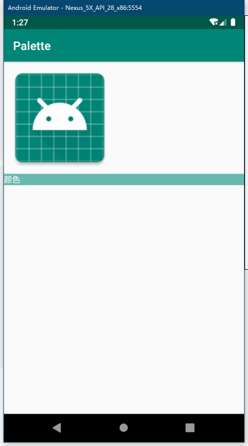

* **ImageView图片必须是drawable文件夹资源**

```xml
<?xml version="1.0" encoding="utf-8"?>
<LinearLayout xmlns:android="http://schemas.android.com/apk/res/android"
    xmlns:app="http://schemas.android.com/apk/res-auto"
    xmlns:tools="http://schemas.android.com/tools"
    android:layout_width="match_parent"
    android:layout_height="match_parent"
    android:orientation="vertical"
    tools:context=".MainActivity">

    <ImageView
        android:id="@+id/iv"
        android:layout_width="wrap_content"
        android:layout_height="wrap_content"
        android:src="@drawable/ic_launcher" />

    <TextView
        android:id="@+id/tv"
        android:layout_width="match_parent"
        android:layout_height="wrap_content"
        android:text="颜色"
        android:textColor="@android:color/white" />

</LinearLayout>
```

```java
public class MainActivity extends AppCompatActivity {

    @Override
    protected void onCreate(Bundle savedInstanceState) {
        super.onCreate(savedInstanceState);
        setContentView(R.layout.activity_main);

        ImageView iv = findViewById(R.id.iv);
        TextView tv = findViewById(R.id.tv);

        BitmapDrawable drawable = (BitmapDrawable) iv.getDrawable();
        Bitmap bitmap = drawable.getBitmap();
        Palette palette = Palette.from(bitmap).generate();
        //如果分析不出来，则返回此颜色
        int color = palette.getLightVibrantColor(Color.TRANSPARENT);
        tv.setBackgroundColor(color);
    }
}
```

###### 效果

