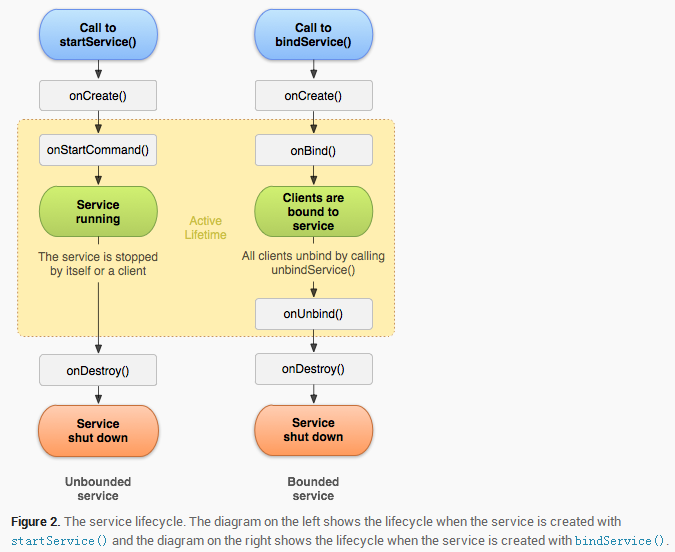

## 生命周期



# 方式1：Start开启Service

一旦服务开启跟调用者(开启者)就没有任何关系了，开启者退出了，开启者挂了，服务还在后台长期的运行，开启者不能调用服务里面的方法

>继承Service类
```java
public class MyService extends Service {
    @Override
    public void onCreate() {
        super.onCreate();
        Log.e("HLP", "onCreate");
    }

    @Override
    public int onStartCommand(Intent intent, int flags, int startId) {
        Log.e("HLP", "onStartCommand");
        return super.onStartCommand(intent, flags, startId);
    }

    @Override
    public void onDestroy() {
        super.onDestroy();
        Log.e("HLP", "onDestroy");
    }

    @Nullable
    @Override
    public IBinder onBind(Intent intent) {
        Log.e("HLP", "onBind");
        return null;
    }
}
```

>清单文件配置
```xml
<?xml version="1.0" encoding="utf-8"?>
<manifest xmlns:android="http://schemas.android.com/apk/res/android"
    package="com.example.android.myapplication">

    <application
        android:allowBackup="true"
        android:icon="@mipmap/ic_launcher"
        android:label="@string/app_name"
        android:roundIcon="@mipmap/ic_launcher_round"
        android:supportsRtl="true"
        android:theme="@style/AppTheme">
        <activity android:name=".MainActivity">
            <intent-filter>
                <action android:name="android.intent.action.MAIN" />

                <category android:name="android.intent.category.LAUNCHER" />
            </intent-filter>
        </activity>
        <service android:name=".MyService" />
    </application>

</manifest>
```

>开启服务和关闭服务
```java
public class MainActivity extends AppCompatActivity {

    private Intent intent;

    @Override
    protected void onCreate(Bundle savedInstanceState) {
        super.onCreate(savedInstanceState);
        setContentView(R.layout.activity_main);

        //开启服务
        intent = new Intent(this, MyService.class);
        startService(intent);
    }

    @Override
    protected void onDestroy() {
        super.onDestroy();
        //关闭服务
        stopService(intent);
    }
}
```

# 方式2：bind

> 布局

```xml
<?xml version="1.0" encoding="utf-8"?>
<androidx.constraintlayout.widget.ConstraintLayout xmlns:android="http://schemas.android.com/apk/res/android"
    xmlns:app="http://schemas.android.com/apk/res-auto"
    xmlns:tools="http://schemas.android.com/tools"
    android:layout_width="match_parent"
    android:layout_height="match_parent"
    tools:context=".MainActivity">

    <Button
        android:id="@+id/btn_start"
        android:layout_width="wrap_content"
        android:layout_height="wrap_content"
        android:text="开启服务"
        app:layout_constraintLeft_toLeftOf="parent"
        app:layout_constraintTop_toTopOf="parent" />

    <Button
        android:id="@+id/btn_end"
        android:layout_width="wrap_content"
        android:layout_height="wrap_content"
        android:text="关闭服务"
        app:layout_constraintBaseline_toBaselineOf="@id/btn_start"
        app:layout_constraintLeft_toRightOf="@id/btn_start" />
</androidx.constraintlayout.widget.ConstraintLayout>
```

> 清单文件

```xml
<?xml version="1.0" encoding="utf-8"?>
<manifest xmlns:android="http://schemas.android.com/apk/res/android"
    package="com.aib.service.demo">

    <application
        android:allowBackup="true"
        android:icon="@mipmap/ic_launcher"
        android:label="@string/app_name"
        android:roundIcon="@mipmap/ic_launcher_round"
        android:supportsRtl="true"
        android:theme="@style/AppTheme">
        <activity android:name=".MainActivity">
            <intent-filter>
                <action android:name="android.intent.action.MAIN" />

                <category android:name="android.intent.category.LAUNCHER" />
            </intent-filter>
        </activity>

        <service android:name=".MyService">

        </service>
    </application>

</manifest>
```

> 代码

```kotlin
class MainActivity : AppCompatActivity() {
    private var bindService: Boolean? = null

    object connection : ServiceConnection {
        override fun onServiceDisconnected(name: ComponentName?) {
            Log.e("HLP", "断开连接")
        }

        override fun onServiceConnected(name: ComponentName?, service: IBinder?) {
            val myBind = service as MyBind
            myBind.downLoad()
        }
    }

    override fun onCreate(savedInstanceState: Bundle?) {
        super.onCreate(savedInstanceState)
        setContentView(R.layout.activity_main)

        btn_start.setOnClickListener {
            val intent = Intent(this, MyService::class.java)
            //绑定服务会返回一个boolean，防止多次解绑服务导致的异常
            bindService = bindService(intent, connection, Context.BIND_AUTO_CREATE)
        }

        btn_end.setOnClickListener {
            closeService(connection)
        }
    }

    override fun onDestroy() {
        closeService(connection)
        super.onDestroy()
    }

    private fun closeService(connection: ServiceConnection) {
        bindService?.let {
            if (it) {
                unbindService(connection)
                bindService = false
            }
        }
    }
}
```

# IntentService类

