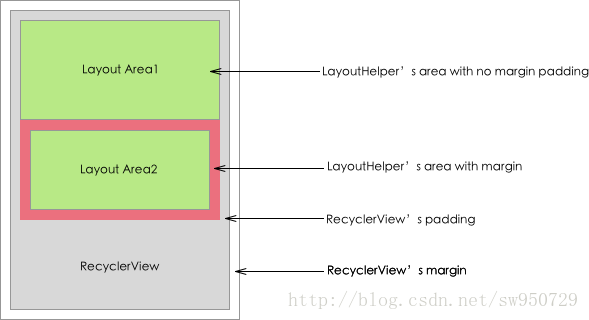
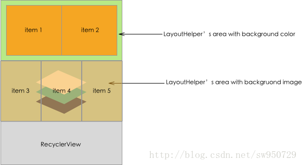
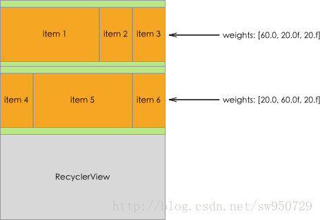

# 间距

* **它不是整个RecyclerView页面的margin和padding，它是每一块LayoutHelper所负责的区域的margin和padding**
* **一个页面里可以有多个LayoutHelper，意味着不同LayoutHelper可以设置不同的margin和padding**
* **LayoutHelper的margin和padding与页面RecyclerView的margin和padding可以共存**
* **目前主要针对非fix类型的LayoutHelper实现了margin和padding，fix类型LayoutHelper内部没有相对位置关系，不处理边距**

```kotlin
val helper = GridLayoutHelper(5)
helper.setPadding(5, 10, 5, 10)	//设置padding
helper.setMargin(5, 5, 5, 5)	//设置margin
```



# 背景

> 设置背景颜色

```kotlin
val helper = GridLayoutHelper(5)

helper.bgColor=Color.RED
```


> 设置背景图片

```kotlin
//1.先对布局管理器设置ImageView工厂
manager.setLayoutViewFactory {
	return@setLayoutViewFactory ImageView(it)
}

//2.在helper里设置绑定监听，取消监听
val helper = GridLayoutHelper(5)
helper.setLayoutViewBindListener { layoutView, baseLayoutHelper ->
            //load image
}

helper.setLayoutViewUnBindListener { layoutView, baseLayoutHelper ->
            //cancel image
}
```



# aspectRatio

# weights

ColumnLayoutHelper, GridLayoutHelper的属性，它们都是提供网格状的布局能力，建议使用GridLayoutHelper，它的能力更加强大，参考下文介绍。默认情况下，每个网格中每一列的宽度是一样的，通过weights属性，可以指定让每一列的宽度成比例分配，就像LinearLayout的weight属性一样。 weights属性是一个float数组，每一项代表某一列占父容器宽度的百分比，总和建议是100，否则布局会超出容器宽度；如果布局中有4列，那么weights的长度也应该是4；长度大于4，多出的部分不参与宽度计算；如果小于4，不足的部分默认平分剩余的空间

```kotlin
        val helper = GridLayoutHelper(4)
        helper.setWeights(floatArrayOf(20f,30f,30f,20f))
```

