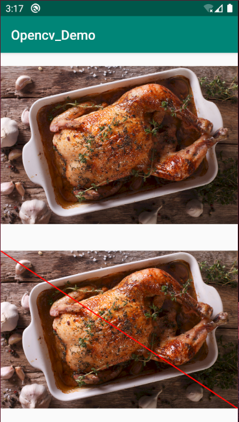

# 基础

### AS读取图片到Mat

图片资源放到`drawable-XXX`这些文件夹下，导致图片尺寸变化，放到`asserts`文件夹下读取图片像素和原图一致


> 从drawable读取图片到Mat


> 从asserts读取图片


### Android图片色彩模式

* ARGB_8888：ARGB 四个通道的值都是 8 位，加起来 32 位，也就是 4 个字节。每个像素点占用 4 个字节的大小
* ARGB_4444：ARGB 四个通道的值都是 4 位，加起来 16 位，也就是 2 个字节。每个像素点占用 2 个字节的大小
* RGB_565：RGB 三个通道分别是 5 位、6 位、5 位，没有 A 通道，加起来 16 位，也就是 2 个字节。每个像素点占用 2 个字节的大小
* ALPHA_8：只有 A 通道，占 8 位，1 个字节。每个像素点占用 1 个字节的大小

# Java

### line函数

在图片上画线

* line(Mat img, Point pt1, Point pt2, Scalar color, int thickness, int lineType, int shift)

img：矩阵

pt1：起始坐标点

pt2：结束坐标点

color：线的颜色

thickness：线的粗细

lineType：线的类型

shift：坐标小数点位数



```java
    /**
     * 在图片上画线
     *
     * @param bitmap
     */
    private void drawLine(Bitmap bitmap) {
        ivOrigin.setImageBitmap(bitmap);
        Mat mat = new Mat();
        Utils.bitmapToMat(bitmap, mat);
        Imgproc.line(mat, new Point(0, 0), new Point(mat.width(), mat.height()), new Scalar(255, 0, 0), 25, Imgproc.LINE_AA, 0);
        Bitmap cvBitmap = Bitmap.createBitmap(mat.width(), mat.height(), Bitmap.Config.RGB_565);
        Utils.matToBitmap(mat, cvBitmap);
        ivOpencv.setImageBitmap(cvBitmap);
    }
```


# NDK