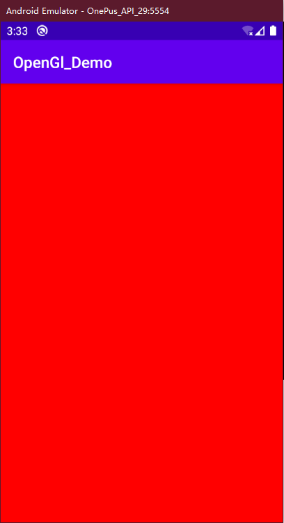

# 绘制背景



```kotlin
class MainActivity : AppCompatActivity() {
    override fun onCreate(savedInstanceState: Bundle?) {
        super.onCreate(savedInstanceState)

        val gl = GLSurfaceView(this)
        setContentView(gl)

        //设置版本
        gl.setEGLContextClientVersion(3)
        gl.setRenderer(object : GLSurfaceView.Renderer {
            override fun onDrawFrame(gl: GL10?) {
                //把颜色缓冲区设置为我们预设的颜色
                GLES30.glClear(GL10.GL_COLOR_BUFFER_BIT)
            }

            override fun onSurfaceChanged(gl: GL10?, width: Int, height: Int) {
                //设置视图窗口
                GLES30.glViewport(0, 0, width, height)
            }

            override fun onSurfaceCreated(gl: GL10?, config: EGLConfig?) {
                //设置背景颜色
                GLES30.glClearColor(255f, 0f, 0f, 255f)
            }
        })
    }
}
```

