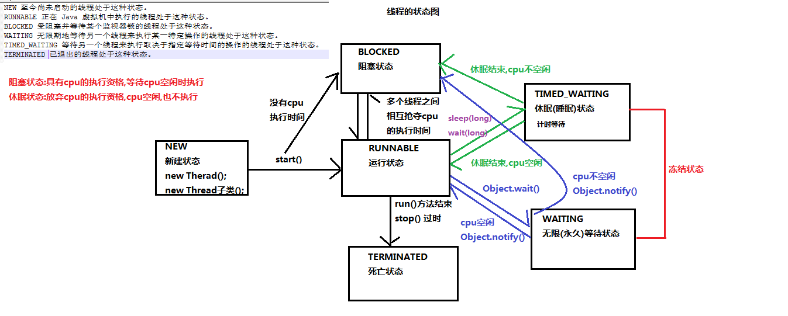

#并发&并行

* **并发：2个或多个事件在同一个时间段发生**
* **并行：2个或多个事件在同一时刻发生（同时发生）**


---

#进程&线程

* **进程：是指一个内存中运行的应用程序，每个进程都有一个独立的内存空间，一个应用程序可以同时运行多个进程；进程也是程序的一次执行过程，是系统运行程序的基本单位；系统运行一个程序即是一个进程从创建、运行到消亡的过程**
* **线程是进程中的一个执行单元，负责当前进程中程序的执行，一个进程中至少有一个线程。一个进程中是可以有多个线程的，这个应用程序也可以称之为多线程程序**
* **一个程序运行后至少有一个进程，一个进程中可以包含多个线程**

---

#创建线程

##方式1

* **自定义类继承Thread类，重写run()方法**

```
public class BookThread extends Thread {
    @Override
    public void run() {
        super.run();

        for (int i = 0; i < 20; i++) {
            System.out.println(i);
        }
    }
}

//启动线程
new BookThread().start();
```

##方式2

* **实现Runnable接口，重写run()方法**

```
public class BookRunnable implements Runnable {
    public void run() {
        System.out.println("数据");
    }
}

//启动线程
new Thread(new BookRunnable()).start();
```

##Thread类和Runnable接口的区别

* **避免单继承的局限性**
* **增强程序扩展性，降低程序耦合**

---

#线程同步机制

##同步代码块

* **锁对象是任意对象**
* **但是必须保证每个线程锁对象是同一个**
* **锁的作用是保证只让一个代码执行锁里面的代码**

```
格式：
    synchronized(锁对象){
        可能出现线程安全问题的代码（访问了共享数据的代码）
    }
```

##同步方法

```
格式：
    修饰符 synchronized 返回值 方法名（）{
    可能出现线程安全问题的代码（访问了共享数据的代码）
    }
```

##Lock锁

```
格式：
    ReentrantLock l = new ReentrantLock();
    l.lock();   //得到锁
    可能出现线程安全问题的代码（访问了共享数据的代码）
    l.unlock(); //释放锁
```

#等待唤醒机制

##线程的状态



##等待唤醒案例

* **适用多线程通信**
* **wait()和notify()需要在同步锁内进行调用**

```
public class Test {
    public static void main(String[] args) {

        final Object obj = new Object();

        new Thread(new Runnable() {
            public void run() {
                System.out.println("顾客：买包子");
                synchronized (obj) {
                    try {
                        obj.wait();
                    } catch (InterruptedException e) {
                        e.printStackTrace();
                    }
                }
                System.out.println("顾客：吃包子");
            }
        }).start();


        new Thread(new Runnable() {
            public void run() {
                System.out.println("老板：开始做包子");
                try {
                    Thread.sleep(5000); //5S制作包子
                } catch (InterruptedException e) {
                    e.printStackTrace();
                }
                synchronized (obj) {
                    obj.notify();
                }
                System.out.println("老板：包子做好了");
            }
        }).start();

    }
}
```

#线程池

```
public class Test {
    public static void main(String[] args) {
        ExecutorService threadPool = Executors.newFixedThreadPool(3);
        threadPool.submit(new Runnable() {
            public void run() {
                System.out.println("线程池");
            }
        });

        threadPool.shutdown();  //不建议调用，调用则销毁线程池，再次使用线程池会抛异常
    }
}
```