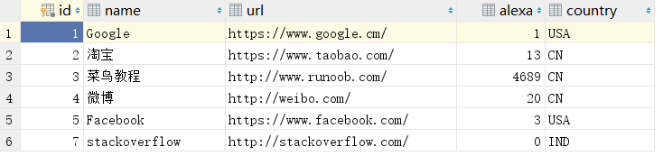
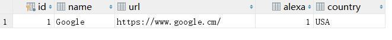
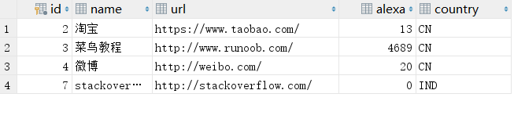

>概述

LIKE操作符用于在WHERE子句中搜索列中的指定模式

>语法结构

```
SELECT column_name(s)
FROM table_name
WHERE column_name LIKE pattern;
```

>测试数据库



>%使用

SQL语句选取name以字母"G"开始的所有客户

```
select * from websites where name like 'G%';
```

输出结果



>NOT关键字

使用NOT关键字，可以选取不匹配模式的记录

```
select * from websites where name not like '%oo%';
```

得到的数据

