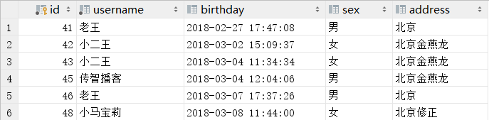
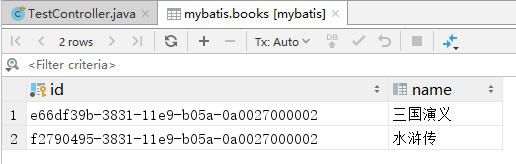

# 查询

##查询全部用户

###映射配置

>接口

```
@Repository
public interface LoginDao {
    List<UserBean> findAll();
}
```

>Mapper映射文件
```
<?xml version="1.0" encoding="UTF-8"?>
<!DOCTYPE mapper
        PUBLIC "-//mybatis.org//DTD Mapper 3.0//EN"
        "http://mybatis.org/dtd/mybatis-3-mapper.dtd">
<mapper namespace="com.aib.dao.LoginDao">
    <select id="findAll" resultType="com.aib.bean.UserBean">
        select * from mybatis.user
    </select>
</mapper>
```

>测试

```
@Controller
public class TestController {

    @Autowired
    private LoginService service;

    @RequestMapping(path = "/test", method = RequestMethod.GET)
    public String login() {
        List<UserBean> all = service.findAll();
        for (UserBean userBean : all) {
            System.out.println(userBean);
        }
        return "index";
    }
}
```

###注解配置

>Dao接口

```
@Repository
public interface LoginDao {
    @Select("select * from user")
    List<UserBean> findAll();
}
```

>测试

```
@Controller
public class TestController {

    @Autowired
    private LoginService service;

    @RequestMapping(path = "/test", method = RequestMethod.GET)
    public String login() {
        List<UserBean> all = service.findAll();
        for (UserBean userBean : all) {
            System.out.println(userBean);
        }
        return "index";
    }
}
```

##根据ID查询用户信息

>mapper接口
```
public interface UserMapper {
    UserBean findUserById(Integer position);
}
```

>mapper映射文件

* **占位符为#{}，里面的名字任意取**

```
<?xml version="1.0" encoding="UTF-8"?>
<!DOCTYPE mapper
        PUBLIC "-//mybatis.org//DTD Mapper 3.0//EN"
        "http://mybatis.org/dtd/mybatis-3-mapper.dtd">
<!--
namespace   mapper接口全路径
id  mapper接口抽象方法
parameterType   参数类型
resultType  返回结果集类型
-->
<mapper namespace="com.aib.mapper.UserMapper">
    <select id="findUserById" parameterType="java.lang.Integer" resultType="com.aib.bean.UserBean">
--     占位符  #{随意名字}
      select * from users where id=#{id}
    </select>
</mapper>
```

>JavaBean
```
public class UserBean {
    private int id;
    private String name;
    private String address;

    public int getId() {
        return id;
    }

    public void setId(int id) {
        this.id = id;
    }

    public String getName() {
        return name;
    }

    public void setName(String name) {
        this.name = name;
    }

    public String getAddress() {
        return address;
    }

    public void setAddress(String address) {
        this.address = address;
    }

    @Override
    public String toString() {
        return "UserBean{" +
                "id=" + id +
                ", name='" + name + '\'' +
                ", address='" + address + '\'' +
                '}';
    }
}
```

>测试
```
class TestController {
    @Test
    void test() throws IOException {
        //注意路径是在resources下
        String resource = "spring-mybatis.xml";
        //加载配置文件
        InputStream inputStream = Resources.getResourceAsStream(resource);
        //SQL会话工厂对象
        SqlSessionFactory sqlSessionFactory = new SqlSessionFactoryBuilder().build(inputStream);
        //打开SQL会话
        SqlSession session = sqlSessionFactory.openSession();

        UserMapper userMapper = session.getMapper(UserMapper.class);
        UserBean userBean = userMapper.findUserById(1);
        System.out.println(userBean.toString());
    }
}
```

##<center>查询用户(模糊查询)

###<center>占位符形式

>mapper映射文件

```
<?xml version="1.0" encoding="UTF-8"?>
<!DOCTYPE mapper
        PUBLIC "-//mybatis.org//DTD Mapper 3.0//EN"
        "http://mybatis.org/dtd/mybatis-3-mapper.dtd">
<mapper namespace="com.aib.mapper.UserMapper">
    <select id="findUser" parameterType="String" resultType="com.aib.bean.UserBean">
      select * from users where name like #{name}
    </select>
</mapper>
```

>mapper接口类
```
public interface UserMapper {
    List<UserBean> findUser(String name);
}
```

>测试类

* **采用占位符形式，就需要在传参的时候加上%**
```
class TestController {
    @Test
    void test() throws IOException {
        String resource = "spring-mybatis.xml";
        InputStream inputStream = Resources.getResourceAsStream(resource);
        SqlSessionFactory sqlSessionFactory = new SqlSessionFactoryBuilder().build(inputStream);
        SqlSession session = sqlSessionFactory.openSession();

        UserMapper userMapper = session.getMapper(UserMapper.class);
        List<UserBean> users = userMapper.findUser("%小%");
        System.out.println(users.toString());
    }
}
```

###<center>拼接符形式
>mapper映射器

* **拼接符形式，需要使用单引号包裹整体内容，${value}是固定写法，不可更改**
* **拼接符形式，有风险，有SQL注入**
```
<?xml version="1.0" encoding="UTF-8"?>
<!DOCTYPE mapper
        PUBLIC "-//mybatis.org//DTD Mapper 3.0//EN"
        "http://mybatis.org/dtd/mybatis-3-mapper.dtd">
<mapper namespace="com.aib.mapper.UserMapper">
    <select id="findUser" parameterType="String" resultType="com.aib.bean.UserBean">
      select * from users where name like '%${value}%'
    </select>
</mapper>
```

>mapper接口
```
public interface UserMapper {
    List<UserBean> findUser(String name);
}
```

>测试
```
class TestController {
    @Test
    void test() throws IOException {
        String resource = "spring-mybatis.xml";
        InputStream inputStream = Resources.getResourceAsStream(resource);
        SqlSessionFactory sqlSessionFactory = new SqlSessionFactoryBuilder().build(inputStream);
        SqlSession session = sqlSessionFactory.openSession();

        UserMapper userMapper = session.getMapper(UserMapper.class);
        List<UserBean> users = userMapper.findUser("小");
        System.out.println(users.toString());
    }
}
```

##查询表的总数

>mapper映射

* **返回值为`int`类型**

```
    <select id="findNum" resultType="int">
        select count(id) from mybatis.user
    </select>
```

---

#<center>插入

##<center>保存用户信息

###映射配置

>mapper映射

* **如果只有一个占位符不要求和JavaBean属性名一致**
* **多个占位符要求和JavaBean属性名一致**

```
<?xml version="1.0" encoding="UTF-8"?>
<!DOCTYPE mapper
        PUBLIC "-//mybatis.org//DTD Mapper 3.0//EN"
        "http://mybatis.org/dtd/mybatis-3-mapper.dtd">
<mapper namespace="com.aib.dao.LoginDao">
    <insert id="addUser" parameterType="com.aib.bean.UserBean">
    
        <!--
    #{}：如果这个属性是在实体嵌套好几层，需要对应 属性.属性.属性 的取值
    -->
    
        insert into mybatis.user(username, birthday, sex, address) values (#{username},#{birthday},#{sex},#{address})
    </insert>
</mapper>
```

>测试类

```
@Controller
public class TestController {

    @Autowired
    private LoginService service;

    @RequestMapping(path = "/test", method = RequestMethod.GET)
    public String login() {
        UserBean bean = new UserBean();
        bean.setUsername("得玛西亚");
        bean.setBirthday(new Date());
        bean.setSex("男");
        bean.setAddress("LOL");
        service.addUser(bean);
        return "index";
    }
}
```

###注解配置

没做案例

##<center>插入数据的主键获取

>mapper映射

* **keyProperty：将得到的主键值传入属性中，来自Bean的属性**
* **order：在insert前或后执行，BEFORE在前执行，AFTER在后执行**
* **resultType：返回主键的数据类型，需要和Bean中的ID类型一致**
```
<?xml version="1.0" encoding="UTF-8"?>
<!DOCTYPE mapper
        PUBLIC "-//mybatis.org//DTD Mapper 3.0//EN"
        "http://mybatis.org/dtd/mybatis-3-mapper.dtd">
<mapper namespace="com.aib.mapper.UserMapper">
    <insert id="addUser" parameterType="com.aib.bean.UserBean">
        <selectKey keyProperty="id" order="AFTER" resultType="java.lang.Integer">
            select LAST_INSERT_ID()
        </selectKey>
        insert into mybatis.users(name, address) values (#{name},#{address})
    </insert>
</mapper>
```

>测试类
```
class TestController {
    @Test
    void test() throws IOException {
        String resource = "spring-mybatis.xml";
        InputStream inputStream = Resources.getResourceAsStream(resource);
        SqlSessionFactory sqlSessionFactory = new SqlSessionFactoryBuilder().build(inputStream);
        SqlSession session = sqlSessionFactory.openSession();

        UserMapper userMapper = session.getMapper(UserMapper.class);
        UserBean bean = new UserBean();
        bean.setName("火星人");
        bean.setAddress("火星球");
        userMapper.addUser(bean);
        session.commit();

        //得到插入数据的ID值
        System.out.println(bean.getId());
    }
}
```

##<center>UUID主键

>SQL表结构

* **主键为varchar类型的时候，因为主键不能自增，只能采用uuid的值作为主键的值**



>mapper映射文件

```
<?xml version="1.0" encoding="UTF-8"?>
<!DOCTYPE mapper
        PUBLIC "-//mybatis.org//DTD Mapper 3.0//EN"
        "http://mybatis.org/dtd/mybatis-3-mapper.dtd">
<mapper namespace="com.aib.mapper.BookMapper">
    <insert id="addBook" parameterType="com.aib.bean.BookBean">
        <selectKey order="BEFORE" keyProperty="id" resultType="java.lang.String">
            select uuid()
        </selectKey>
        insert into mybatis.books(id,name) values (#{id},#{name})
    </insert>
</mapper>
```

>测试类

```
class TestController {
    @Test
    void test() throws IOException {
        String resource = "spring-mybatis.xml";
        InputStream inputStream = Resources.getResourceAsStream(resource);
        SqlSessionFactory sqlSessionFactory = new SqlSessionFactoryBuilder().build(inputStream);
        SqlSession session = sqlSessionFactory.openSession();

        BookMapper mapper = session.getMapper(BookMapper.class);
        BookBean bean = new BookBean();
        bean.setName("水浒传");
        mapper.addBook(bean);
        session.commit();
    }
}
```

---

#<center>删除

##<center>根据ID删除用户信息

>mapper映射文件
```
<?xml version="1.0" encoding="UTF-8"?>
<!DOCTYPE mapper
        PUBLIC "-//mybatis.org//DTD Mapper 3.0//EN"
        "http://mybatis.org/dtd/mybatis-3-mapper.dtd">
<mapper namespace="com.aib.mapper.UserMapper">
    <delete id="deleteUser" parameterType="java.lang.Integer">
        delete from mybatis.users where id=#{id}
    </delete>
</mapper>
```

---

#<center>更新

##<center>根据ID更新用户信息

>mapper映射文件
```
<?xml version="1.0" encoding="UTF-8"?>
<!DOCTYPE mapper
        PUBLIC "-//mybatis.org//DTD Mapper 3.0//EN"
        "http://mybatis.org/dtd/mybatis-3-mapper.dtd">
<mapper namespace="com.aib.mapper.UserMapper">
    <update id="updateUser" parameterType="com.aib.bean.UserBean">
        update mybatis.users set name=#{name} where id=#{id}
    </update>
</mapper>
```