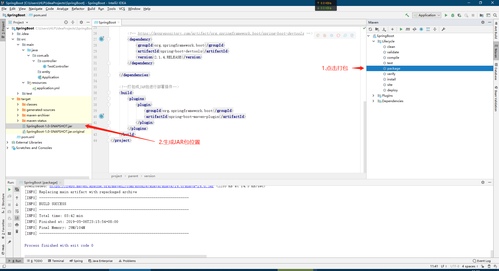

# 环境搭建 

## 添加Maven依赖

```
<?xml version="1.0" encoding="UTF-8"?>
<project xmlns="http://maven.apache.org/POM/4.0.0"
         xmlns:xsi="http://www.w3.org/2001/XMLSchema-instance"
         xsi:schemaLocation="http://maven.apache.org/POM/4.0.0 http://maven.apache.org/xsd/maven-4.0.0.xsd">
    <modelVersion>4.0.0</modelVersion>

    <!-- Inherit defaults from Spring Boot -->
    <parent>
        <groupId>org.springframework.boot</groupId>
        <artifactId>spring-boot-starter-parent</artifactId>
        <version>2.1.4.RELEASE</version>
    </parent>

    <groupId>SpringBoot</groupId>
    <artifactId>SpringBoot</artifactId>
    <version>1.0-SNAPSHOT</version>

    <dependencies>
        <!-- https://mvnrepository.com/artifact/org.springframework.boot/spring-boot-starter-web -->
        <dependency>
            <groupId>org.springframework.boot</groupId>
            <artifactId>spring-boot-starter-web</artifactId>
            <version>2.1.4.RELEASE</version>
        </dependency>
    </dependencies>

</project>
```

## SpringBoot引导类

* **创建`Application`类，类上使用注解`@SpringBootApplication`**
* **在`main`方法调用`SpringApplication.run(Application.class);`**

```
@SpringBootApplication
public class Application {
    public static void main(String[] args) {
        SpringApplication.run(Application.class);
    }
}
```


---


# 热部署

* **无需重写运行Tomcat即可运行修改后的代码**

##引入依赖库

```
<!-- https://mvnrepository.com/artifact/org.springframework.boot/spring-boot-devtools -->
<dependency>
    <groupId>org.springframework.boot</groupId>
    <artifactId>spring-boot-devtools</artifactId>
    <version>2.1.4.RELEASE</version>
</dependency>

```

##开启自动编译

**步骤1**


**步骤2**


---

#yml&yaml

* **YML文件格式是YAML (YAML Aint Markup Language)编写的文件格式,YML文件是以数据为核心的，比传统的xml方式更加简洁**
* **YML文件的扩展名可以使用.yml或者.yaml**

##配置数据

###配置普通数据

* **key: value**
* **注意value前需要空格**

```
name: haohao
```

### 配置对象数据

```
person:
name: haohao
age: 31
addr: beijing
#或者
person: {name: haohao,age: 31,addr: beijing}

语法：
key:
key1: value1
key2: value2
或者：
key: {key1: value1,key2: value2}

注意：key1前面的空格个数不限定，在yml语法中，相同缩进代表同一个级别
```

###配置数组&集合

```
语法：
key:
- value1
- value2
或者：
key: [value1,value2]


city:
- beijing
- tianjin
- shanghai
- chongqing
#或者
city: [beijing,tianjin,shanghai,chongqing]
#集合中的元素是对象形式
student:
- name: zhangsan
age: 18
score: 100
- name: lisi
age: 28
score: 88
- name: wangwu
age: 38
score: 90

```

##获取配置数据

###@Value方式

###@ConfigurationProperties

* ****

```

```

---

# 整合mybatis

## mybatis依赖

* **spring-boot-starter在后面不是spring-boot-starter启动器，而是mybatis提供的**

```xml
        <!--mybatis起步依赖-->
        <dependency>
            <groupId>org.mybatis.spring.boot</groupId>
            <artifactId>mybatis-spring-boot-starter</artifactId>
            <version>2.0.1</version>
        </dependency>
```

## SQL驱动

```xml
        <!-- MySQL连接驱动 -->
        <dependency>
            <groupId>mysql</groupId>
            <artifactId>mysql-connector-java</artifactId>
            <version>8.0.13</version>
        </dependency>
```

## SQL连接信息

```properties
#DB Configuration:
spring.datasource.driverClassName=com.mysql.jdbc.Driver
spring.datasource.url=jdbc:mysql://127.0.0.1:3306/test?
useUnicode=true&characterEncoding=utf8
spring.datasource.username=root
spring.datasource.password=root
```

## mybatis连接信息

```properties
#pojo别名扫描包
mybatis.type-aliases-package=com.itheima.domain
#加载Mybatis映射文件
mybatis.mapper-locations=classpath:mapper/*.xml
```

## MapperScan注解

```java
@SpringBootApplication
@MapperScan("com.aib.dao")  //扫描Mapper接口
public class Application {
    public static void main(String[] args) {
        SpringApplication.run(Application.class, args);
    }
}
```


# 部署项目

* **添加打包插件**

```xml
    <!--打包成JAR包进行部署插件-->
    <build>
        <plugins>
            <plugin>
                <groupId>org.springframework.boot</groupId>
                <artifactId>spring-boot-maven-plugin</artifactId>
            </plugin>
        </plugins>
    </build>
```

* **打包**



* **执行JAR包**

```
java -jar xxx
```

