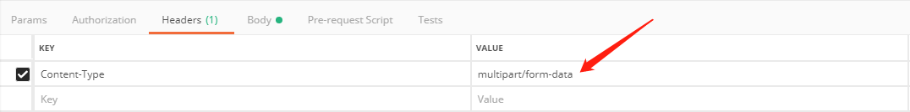
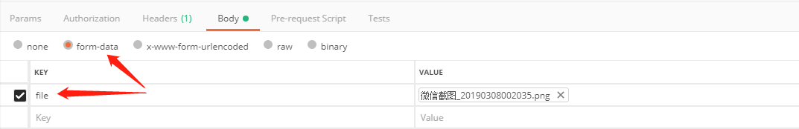

# 单文件上传

## 解析器

* **需要在springmvc配置文件中进行配置文件上传下载解析器**
```xml
    <!-- 文件上传 -->
    <bean id="multipartResolver" class="org.springframework.web.multipart.commons.CommonsMultipartResolver">
        <property name="maxUploadSize" value="104857600"/>
        <property name="maxInMemorySize" value="4096"/>
        <property name="defaultEncoding" value="UTF-8"/>
    </bean>
```

## 文件上传下载库

* **使用Tomcat9.0不需要配置，因为Tomcat9.0已经集成此库，Tomcat9.0以下需要配置**
* **commons-fileupload.jar**
* **commens-io-X.X.jar**
```
https://mvnrepository.com/artifact/commons-fileupload/commons-fileupload
```

## 控制器

* **文件上传需要采用注解`RequestParam`，注解参数名即Client文件上传的参数名，可自定义，Server和Client保持一致就行**
```java
@Controller
public class TestController {
    @RequestMapping(path = "/test", method = RequestMethod.POST)
    private String login(@RequestParam("file") MultipartFile file, Model model) throws IOException {
        String path = "D:\\WebFileServer\\test\\" + UUID.randomUUID().toString()+".jpg";
        File newFile = new File(path);
        file.transferTo(newFile);
        model.addAttribute("json", "上传成功");
        return "index";
    }
}
```

## POSTMAN测试

* **`Content-Type`的值需要使用`multipart/form-data`**


* **文件放在请求体中**
* **格式需要采用`multipart/form-data`**
* **注意参数key使用的就是控制器中方法注解参数的名字`file`**
