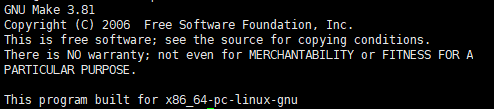

>打开文件
```shell
vim ~/.bashrc
```

>插入环境

在文件最好面插入下面的代码，然后保存文件并关闭
```shell
export NDKROOT=/usr/ndk/android-ndk-r12b
export PATH=$NDKROOT:$PATH
```

>执行环境生效
```shell
source ~/.bashrc
```

>检测NDK是否成功配置
```sh
#注意-v前面的空格
ndk-build -v
```

输出下面内容则配置成功


